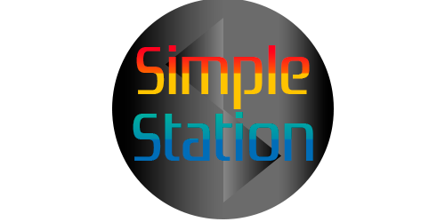

  

<h2 align="center">A simple, multiplatform, Sony Playstation 1 (PSX) emulator written in C23</h2>

 

<table>
<thead>
  <tr>
    <td><h4>PSX Boot</h4></td>
    <td><h4>Experimental Vulkan Rendered Boot</h4></td>
    <td><h4>Amidog CPU Tests</h4></td>
    <td><h4>Quads Demo</h4></td>
    <td><h4>Goraud Triangle Demo</h4></td>
    <td><h4>BIOS Menu</h4></td>
  </tr>
</thead>
</table>

## ✨ Features
* Targets [C23](https://en.cppreference.com/w/c/23) features (Fallbacks present if not available)
* LLE Interpreter
* Multiplatform
* Multiarchitecture
* Hardware Renderer (OpenGL 3.3, and an experimental Vulkan renderer)

## 🖥️ Current state
#### CPU Subsystem
- All opcodes implemented (100%)
  - Regular, e(X)tended, Jump and Branch Opcodes
  - MIPS Coprocessor 0 Opcodes
  - MIPS 5-stage Instruction Pipeline Emulation
  - Readable-format disassembler with debugger and breakpoint support
  - Custom gdbstub implementation to debug PSX code with gdb
- No cache emulation (_Yet!_)

#### GPU Subsystem
- Sony's Propietary GPU
  - _In the works_
- Sony's Coprocessor 2 "GTE" (Geometry Transformation Engine)
  - _In the works_

#### DMA Subsystem
- DMA Unit
  - _In the works_

#### CDROM Subsystem
- CDROM Unit
  - _In the works_
    
## 👷🏼‍♂️ Roadmap
* MIPS I R3000A to x86_64 (AMD64) Dynamic Recompilation (JIT)

## 📃 Documentation
* Integrated Device Technology, Inc. (1996). _IDT MIPS Microprocessor Family Software Reference Manual_. Wayback Machine. [https://web.archive.org/web/20061010210946/http://decstation.unix-ag.org/docs/ic_docs/3715.pdf](https://web.archive.org/web/20061010210946/http://decstation.unix-ag.org/docs/ic_docs/3715.pdf)
* Flandrin, L. (2016, 20 October). _Playstation Emulation Guide_. svkt.org. [https://svkt.org/~simias/guide.pdf](https://svkt.org/~simias/guide.pdf)
* PlayStation Specifications - psx-spx. (2022). PSX SPX Consoledev. [https://psx-spx.consoledev.net/](https://psx-spx.consoledev.net/)
* Copetti, R. (2022, December 24). PlayStation Architecture. The Copetti Site. [https://www.copetti.org/writings/consoles/playstation/]
